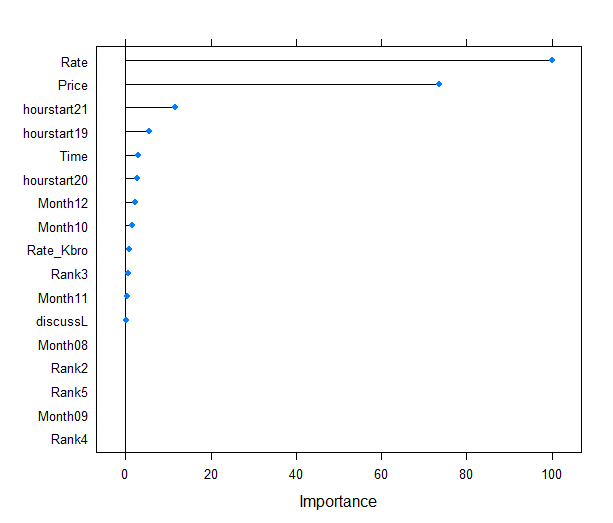

# 收視率排名之於電視節目廣告價格分析結果

```{r echo=FALSE}
require(tidyverse)
require(jiebaR)
require(wordcloud2)
require(lubridate)
require(caret)
Datapath <- "C:/Users/hulu0201/Documents/GitHub/OD_Final/data/"
```

## 高收視排名節目(e.g.初戀的情人)

```{r}
important <- readRDS(paste0(Datapath, "impprogram.rds"))
knitr::kable(important)
```

## Heatmap
#### 顏色的深淺來表示各項目的影響力

```{r echo=FALSE}
finalCount <- readRDS(paste0(Datapath, "API_Totalcount.rds"))
rateTOP5 <- readRDS(paste0(Datapath, "Hitoprogram.rds"))
progLOS <- readRDS(paste0(Datapath, "adPriceprogdata_LOS.rds"))
adPriceprogdata <- readRDS(paste0(Datapath, "adPriceprogdata.rds"))
# preprocess 
adprogamData <- inner_join(progLOS, adPriceprogdata, by = c("p", "dt", "st", "et", "ch", "cn", "ct")) %>% unique()
adprogamData <- rename(adprogamData, Time = v.x)
adprogamData <- rename(adprogamData, v = v.y)
rateTOP5$Rank <-  rev(rateTOP5$Rank)
rateTOP5$dt <- paste0("2018", rateTOP5$Month, rateTOP5$day)
rateTOP5$st <- paste0("2018", rateTOP5$Month, rateTOP5$day, rateTOP5$Period, "00")
rateTOP5$st <- rateTOP5$st %>% str_remove_all(":")
mergetest <- merge(rateTOP5, adprogamData, by = c("dt", "ct", "ch"))
mergetest$st.x <- ymd_hms(mergetest$st.x)
mergetest$st.y <- ymd_hms(mergetest$st.y)
mergetest$gap <- abs(mergetest$st.y - mergetest$st.x)
# <=180secs
mergeData <- mergetest %>% filter(gap <= 300) 
mergeData <- mergeData[! duplicated(mergeData),]
# remove :episode number
mergeData$p <- str_remove(mergeData$p, "\\:\\d*") 
# select columns
mergeData <- mergeData %>% filter(Rank %in% c(1)) %>% 
  select(dt, ct, ch, Rank, Rate, CPM, Price, Error, Month, day, hourstart, Ratekind, k, p, cn, Time ,v)
# group_by Month => median()
plotData <- mergeData %>% group_by(Month, p) %>% summarise(medianCPM = median(CPM),
                                                           medianRate = median(Rate),
                                                           medianPrice = median(Price),
                                                           medianTime_hkton = median(as.numeric(Time)),
                                                           medianRate_hkton = median(as.numeric(v)), 
                                                           )# Rank = median(as.numeric(Rank))
# format (format="f" gives floating numbers)
plotData$medianRate <- formatC(plotData$medianRate, digits = 2, format = "f")
plotData$medianCPM <- formatC(plotData$medianCPM, digits = 0, format = "f")
colnames(plotData) <- c("Month", "Name", "CPM", "Rate", "Price", "Time", "Rate_Kbro" ) #,"Rank"
plotData$CPM <- as.numeric(plotData$CPM)
plotData$Rate <- as.numeric(plotData$Rate)
# bind social volum
Analyzedata <- inner_join(finalCount, plotData, by = c("Month", "Name")) %>% select(-discuss)
# Heatmap
Analyzedata <- Analyzedata %>% arrange(desc(TotalCount)) %>% head(10)

Analyzedata[,c("TotalCount", "CPM", "Rate", "Price", "Time", "Rate_Kbro")] <-  # , "Rank"
  apply(Analyzedata[,c("TotalCount", "CPM", "Rate", "Price", "Time", "Rate_Kbro")], 2, scale) # scale處理，將數值轉為平均=0  #, "Rank"
Analyzedata.m <- gather(Analyzedata, key = "variable", value = "value", -c(Month, Name)) ##寬轉長

# ggplot(Analyzedata.m, aes(variable, Name)) +
#   geom_tile(aes(fill = value),colour = "white")+ #geom_tile: 區塊著色
#   scale_fill_gradient(low = "white",high = "steelblue") + #數值低：白色
#   facet_wrap(Month ~.) + theme_grey()
```


## 文字雲 Wordcluod
### PTT上關鍵字

```{r echo=FALSE, results = "hide"}

PttData <- readRDS(paste0(Datapath, "PTT_Taiwandrama.rds"))
Ptt_posts <- PttData
# 
Ptt_posts$Title <- Ptt_posts$Title %>% str_trim() %>% as.character()
# find article category
Ptt_posts$cate <- str_extract(Ptt_posts$Title, "\\[.*\\]") %>% 
  str_remove("\\]") %>% str_remove("\\[") %>% toupper()
# find article Name
# \\]:  literal “]”   
# +: 1 or more.
# *: 0 or more. 
Ptt_posts$Title <- Ptt_posts$Title %>% str_remove("[A-Z]*.*\\]+ ") %>% str_trim() %>% as.character()
# separate date with /
Ptt_posts$Date <-  as.character(Ptt_posts$Date)
Ptt_posts <- separate(Ptt_posts, Date, into = c("Mon", "Day"), sep = "\\/")
Ptt_posts$Mon <- str_trim(Ptt_posts$Mon)
# remove June & January
Ptt_posts <- Ptt_posts %>% filter(!Mon %in% c("1", "6"))

# JiebaR 
cutter <- worker()
new_user_word(cutter,'三明治女孩的逆襲',"n")
new_user_word(cutter,'女兵日記',"n")
new_user_word(cutter,'初戀的情人',"n")
new_user_word(cutter,'公視新創電影',"n")
new_user_word(cutter,'20之後',"n")
new_user_word(cutter,'人際關係事務所',"n")
new_user_word(cutter,'女兵日記',"n")
new_user_word(cutter,'雙城故事',"n")
new_user_word(cutter,'公視人生劇展',"n")
new_user_word(cutter,'憤怒的菩薩',"n")
new_user_word(cutter,'艾蜜麗的五件事',"n")
new_user_word(cutter,'你的孩子不是你的孩子',"n")
new_user_word(cutter,'前男友不是人',"n")
new_user_word(cutter,'高校英雄傳',"n")
new_user_word(cutter,'高塔公主',"n")
new_user_word(cutter,'愛的3.14159',"n")
new_user_word(cutter,'搖滾畢業生',"n")
new_user_word(cutter,'種菜女神',"n")
new_user_word(cutter,'女兵日記女力報到',"n")

# sort(table(cutter[Ptt_posts$Title]),decreasing = T)
test <- as.data.frame(table(cutter[Ptt_posts$Title]))
test <- test %>% filter(! Var1 %in% c("的", "第", "集", "台"))
test <- test %>% filter(Freq > 15)

# # Worldcloud2
# wordcloud2(test, color = "random-light", backgroundColor = "grey", 
#            fontFamily = "Microsoft JhengHei", minRotation = -pi/2, maxRotation = -pi/2)

```


## 重要因子 Relevant Variables (Lasso)
#### least absolute shrinkage and selection operator 變數挑選

```{r echo=FALSE}

finalCount <- readRDS(paste0(Datapath, "API_Totalcount.rds"))
rateTOP5 <- readRDS(paste0(Datapath, "Hitoprogram.rds"))
progLOS <- readRDS(paste0(Datapath, "adPriceprogdata_LOS.rds"))
adPriceprogdata <- readRDS(paste0(Datapath, "adPriceprogdata.rds"))
# preprocess 
adprogamData <- inner_join(progLOS, adPriceprogdata, by = c("p", "dt", "st", "et", "ch", "cn", "ct")) %>% unique()
adprogamData <- rename(adprogamData, Time = v.x)
adprogamData <- rename(adprogamData, v = v.y)

rateTOP5$dt <- paste0("2018", rateTOP5$Month, rateTOP5$day)
rateTOP5$st <- paste0("2018", rateTOP5$Month, rateTOP5$day, rateTOP5$Period, "00")
rateTOP5$st <- rateTOP5$st %>% str_remove_all(":")
mergetest <- merge(rateTOP5, adprogamData, by = c("dt", "ct", "ch"))
mergetest$st.x <- ymd_hms(mergetest$st.x)
mergetest$st.y <- ymd_hms(mergetest$st.y)
mergetest$gap <- abs(mergetest$st.y - mergetest$st.x)
# <=180secs
mergeData <- mergetest %>% filter(gap <= 300) 
mergeData <- mergeData[! duplicated(mergeData),]
# remove :episode number
mergeData$p <- str_remove(mergeData$p, "\\:\\d*") 
# select columns
mergeData <- mergeData %>% select(dt, ct, ch, Rank, Rate, CPM, Price, Error, Month, day, hourstart, Ratekind, k, p, cn, Time ,v)
# Price 
# mergeData$CPM %>% median() 96
# mergeData$CPM %>% summary() 
# Min. 1st Qu.  Median    Mean 3rd Qu.    Max. 
# 0.00   78.75   96.00   96.31  110.00  237.00 
Priceanalyzedf <- inner_join(finalCount, mergeData, by = c("Month", "Name" = "p")) 
Priceanalyzedf <- Priceanalyzedf %>% select(Rank, Rate, CPM, Price, Month, hourstart, Ratekind, cn, Time ,v, discuss)
Priceanalyzedf$outcome <- ifelse(Priceanalyzedf$CPM < 79 , "Y", "N")
Priceanalyzedf <- rename(Priceanalyzedf, Rate_Kbro = v)
Priceanalyzedf$Rate_Kbro <- as.numeric(Priceanalyzedf$Rate_Kbro)
Priceanalyzedf$Time <- as.numeric(Priceanalyzedf$Time)
#
Priceanalyzedf[,c("Rate" ,"Price", "Time", "Rate_Kbro")] <-
  apply(Priceanalyzedf[,c("Rate" , "Price", "Time", "Rate_Kbro")], 2, scale)
#
cols <- colnames(Priceanalyzedf[,c("Rank", "Month", "hourstart", "cn", "discuss", "outcome")])
test <- as.data.frame(Priceanalyzedf)
test[cols] <- lapply(test[cols], factor)
# 
set.seed(123)
lasso <- train(
  outcome ~ Rank + Rate + Price +  Month + hourstart +  Time + Rate_Kbro + discuss, test,
  tuneGrid = expand.grid(alpha = 1,
                         lambda = 10^seq(-3, 3, length = 100)), #seq(0.0001, 1, length = 20)),
  # family="binomial", #na.action = na.omit,
  metric = "ROC",
  method = "glmnet",
  # preProc=c("center", "scale"), 
  trControl = trainControl(method = "cv", number = 10, classProbs=TRUE, summaryFunction = twoClassSummary)
)
# Model coefficients
coef(lasso$finalModel, lasso$bestTune$lambda)

# Importance var
# plot(varImp(lasso,scale=T))

```

### 重要假設
#### 購買與否依據CPM是否小於25 quentile

```{r }

mergeData$CPM %>% summary() 


```


{width=80%}


