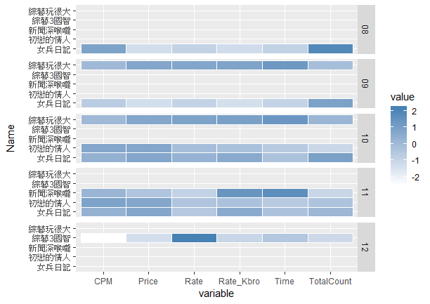
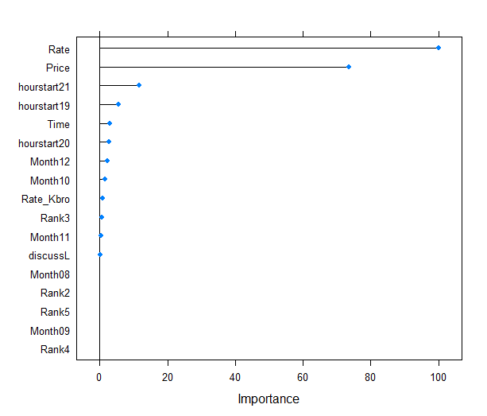

OD\_Final
================

# 收視率排名之於電視節目廣告價格分析結果

    ## Loading required package: tidyverse

    ## -- Attaching packages -------------------------------------------------------------------------------- tidyverse 1.2.1 --

    ## √ ggplot2 3.1.1       √ purrr   0.3.2  
    ## √ tibble  2.1.1       √ dplyr   0.8.0.1
    ## √ tidyr   0.8.3       √ stringr 1.4.0  
    ## √ readr   1.3.1       √ forcats 0.4.0

    ## -- Conflicts ----------------------------------------------------------------------------------- tidyverse_conflicts() --
    ## x dplyr::filter() masks stats::filter()
    ## x dplyr::lag()    masks stats::lag()

    ## Loading required package: jiebaR

    ## Loading required package: jiebaRD

    ## Loading required package: wordcloud2

    ## Loading required package: lubridate

    ## 
    ## Attaching package: 'lubridate'

    ## The following object is masked from 'package:base':
    ## 
    ##     date

    ## Loading required package: caret

    ## Loading required package: lattice

    ## 
    ## Attaching package: 'caret'

    ## The following object is masked from 'package:purrr':
    ## 
    ##     lift

## 高收視排名節目(e.g.初戀的情人)

``` r
important <- readRDS(paste0(Datapath, "impprogram.rds"))
knitr::kable(important)
```

| dt       | ct | ch | Rank | Rate | CPM | Price | Error | Month | day | hourstart | Ratekind | k  | p     | cn        | Time   | v      |
| :------- | :- | :- | :--- | ---: | --: | ----: | :---- | :---- | :-- | :-------- | :------- | :- | :---- | :-------- | :----- | :----- |
| 20181018 | 綜合 | 42 | 1    | 1.69 | 110 | 37500 | 0.89  | 10    | 18  | 20        | H        | HD | 初戀的情人 | TVBS歡樂台HD | 0.7283 | 1.6184 |
| 20181024 | 綜合 | 42 | 1    | 1.68 | 111 | 37500 | 0.89  | 10    | 24  | 20        | H        | HD | 初戀的情人 | TVBS歡樂台HD | 0.6937 | 1.5416 |
| 20181026 | 綜合 | 42 | 1    | 1.34 | 139 | 37500 | 0.8   | 10    | 26  | 20        | H        | HD | 初戀的情人 | TVBS歡樂台HD | 0.6264 | 1.3920 |
| 20181031 | 綜合 | 42 | 1    | 1.68 | 111 | 37500 | 0.89  | 10    | 31  | 20        | H        | HD | 初戀的情人 | TVBS歡樂台HD | 0.6127 | 1.3616 |
| 20181101 | 綜合 | 42 | 1    | 1.65 | 113 | 37500 | 0.88  | 11    | 01  | 20        | H        | HD | 初戀的情人 | TVBS歡樂台HD | 0.6240 | 1.3867 |
| 20181113 | 綜合 | 42 | 1    | 1.66 | 112 | 37500 | 0.89  | 11    | 13  | 20        | H        | HD | 初戀的情人 | TVBS歡樂台HD | 0.6906 | 1.5347 |
| 20181114 | 綜合 | 42 | 1    | 1.74 | 107 | 37500 | 0.91  | 11    | 14  | 20        | H        | HD | 初戀的情人 | TVBS歡樂台HD | 0.6339 | 1.4087 |

## Heatmap

#### 顏色的深淺來表示各項目的影響力



## 文字雲 Wordcluod

### PTT上關鍵字


## 重要因子 Relevant Variables (Lasso)

#### least absolute shrinkage and selection operator 變數挑選

    ## 18 x 1 sparse Matrix of class "dgCMatrix"
    ##                        1
    ## (Intercept)  -4.44630350
    ## Rank2         .         
    ## Rank3         0.11716865
    ## Rank4         .         
    ## Rank5         .         
    ## Rate         19.65746608
    ## Price       -14.45970350
    ## Month08       .         
    ## Month09       .         
    ## Month10      -0.31078832
    ## Month11      -0.06308259
    ## Month12       0.44754560
    ## hourstart19  -1.07417148
    ## hourstart20  -0.54641466
    ## hourstart21  -2.28709354
    ## Time         -0.58563254
    ## Rate_Kbro     0.16029117
    ## discussL     -0.04124592

### 重要假設

#### 購買與否依據CPM是否小於25 quentile

``` r
mergeData$CPM %>% summary() 
```

    ##    Min. 1st Qu.  Median    Mean 3rd Qu.    Max. 
    ##    0.00   78.75   96.00   96.31  110.00  237.00


